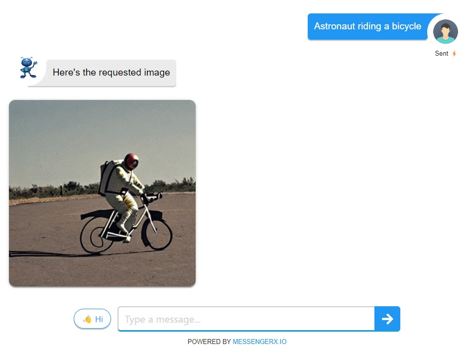

# Stable Diffusion Chatbot
Generate FREE AI images on your laptop with this stable diffusion chatbot.

 

## Requirements for running it locally on laptop ##
* Windows / Mac / Linux with Git installed
* Python 3.9+ 
* Conda Environment (Python)
* A FREE MessengerX.io Account
* Ngrok for Tunneling
* Desktop / Laptop with a minimum of 12GB RAM 
* GPU is required for faster inference (MPS on MAC M1 & CUDA is supported for Nvidia GPU)
* Note: Inference time can take anywhere between 60s to 180s depending on your device capabilities 
* Some optimizations may affect the quality of image produced for complex prompts

## Setup Conda Environment
A suitable [conda](https://conda.io/) environment named `ldm` can be created
```
For windows / linux:
conda env create -f environment.yml

For m1 mac: MAC OS 12.3+ (minimum requirements)
brew install cmake
conda env create -f environment-m1.yml

conda activate ldm
```

### Setup Weights
Currently the following checkpoints are available:
- [`sd-v1-1.ckpt`](https://huggingface.co/CompVis/stable-diffusion-v-1-1-original/resolve/main/sd-v1-1.ckpt) 
- [`sd-v1-2.ckpt`](https://huggingface.co/CompVis/stable-diffusion-v-1-2-original/resolve/main/sd-v1-2.ckpt)
- [`sd-v1-3.ckpt`](https://huggingface.co/CompVis/stable-diffusion-v-1-3-original/resolve/main/sd-v1-3.ckpt)
- [`sd-v1-4.ckpt`](https://huggingface.co/CompVis/stable-diffusion-v-1-4-original/resolve/main/sd-v1-4.ckpt)

Download any one of the above weights

## Linking & Running the chatbot
After [obtaining the `stable-diffusion-v1-*-original` weights](#weights)
For Linux / Mac OS
```
mkdir -p models/ldm/stable-diffusion-v1/
ln -s <path/to/model.ckpt> models/ldm/stable-diffusion-v1/model.ckpt 
```
For Windows
```
mkdir -p models\ldm\stable-diffusion-v1\
mklink /h models\ldm\stable-diffusion-v1\model.ckpt <path\to\model.ckpt>
```

Usage:
Can take about 30s to 60s to intialize and load the model
```
python3 run.py
```

You should get an output in the console on successful start:
```
Loading model from models/ldm/stable-diffusion-v1/model.ckpt
Global Step: 470000
UNet: Running in eps-prediction mode
...
```

### Start your ngrok.io tunnel ###
```
ngrok http 5000
```

### Update your webhook ###
Update your bot Webhook URL at [MessengerX.io Portal](https://portal.messengerx.io) with the url provided as shown below to continue development
Your webhook URL would be of the format as in the example below
```
https://<Your NGROK URL>/webhooks/machaao/incoming 
```
